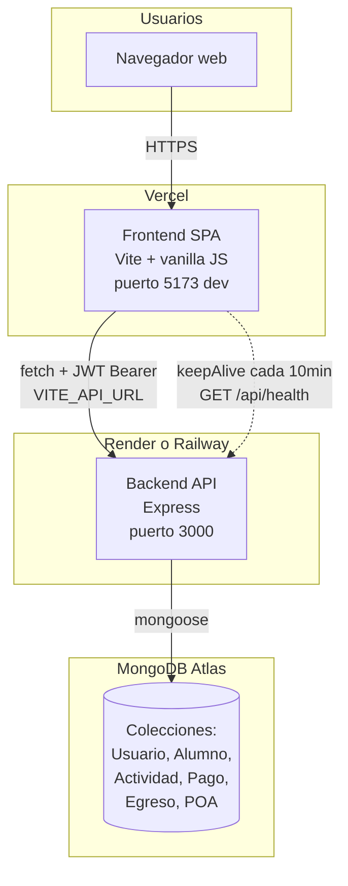
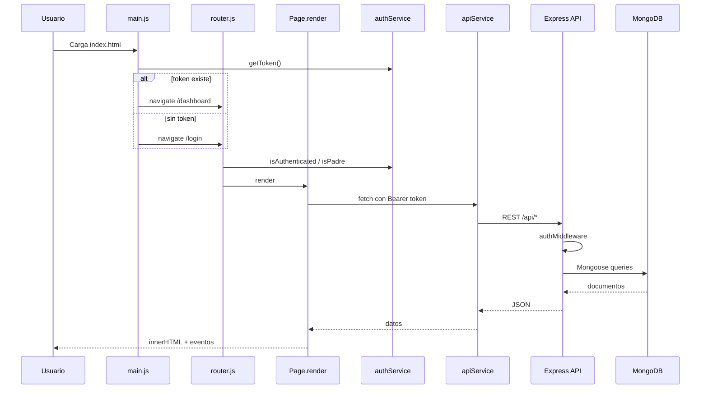
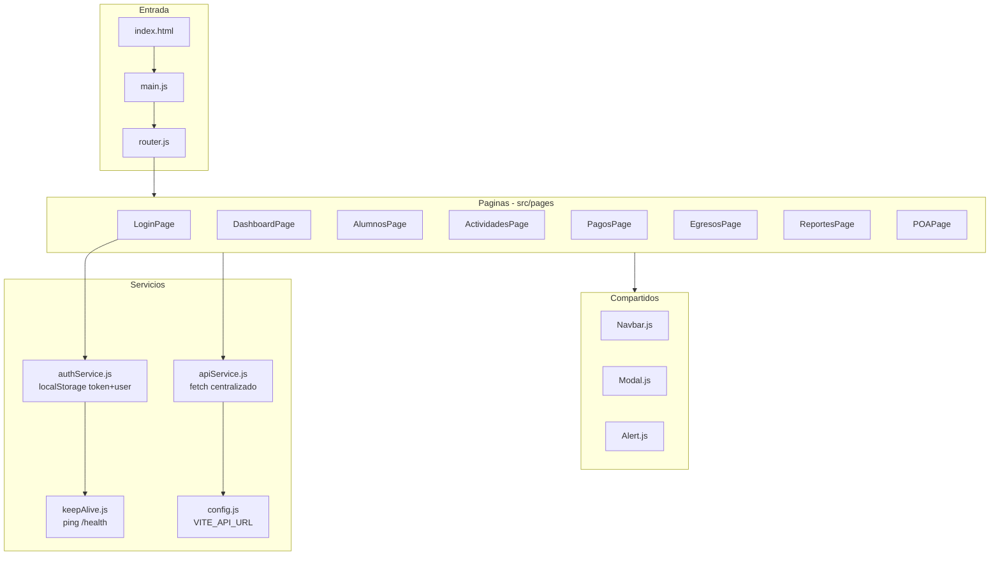
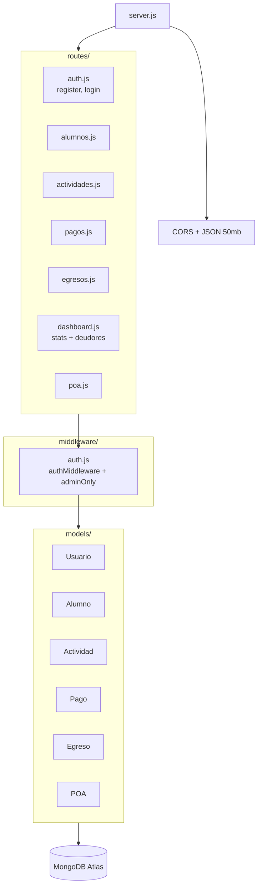
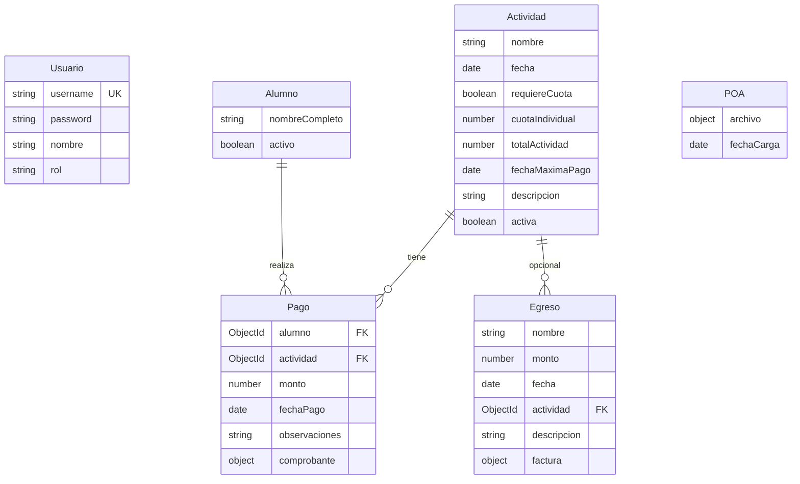
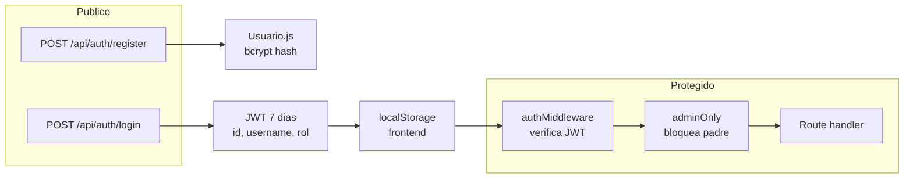

# Diagrama y mapa del codebase APP TESO

Documento de referencia para entender la arquitectura, el flujo de datos y dónde hacer cambios en el proyecto.

## Qué es el proyecto

**APP TESO** es una aplicación web de **tesorería escolar** para el curso 8vo C. Permite gestionar alumnos, actividades con cuotas, pagos, egresos, reportes de deudores y el POA (Plan Operativo Anual) en PDF.

**Monorepo** con dos paquetes independientes:

- [`frontend/`](frontend/) — SPA con Vite + JavaScript vanilla (sin React)
- [`backend/`](backend/) — API REST con Express + Mongoose

**No usa Supabase** ni Docker. La base de datos es **MongoDB Atlas** exclusivamente.

---

## Arquitectura general (despliegue)



### Variables de entorno

| Paquete | Archivo | Variables |
|---------|---------|-----------|
| Frontend | [`frontend/.env`](frontend/.env) | `VITE_API_URL` (ej. `http://localhost:3000/api`) |
| Backend | [`backend/.env`](backend/.env) | `MONGODB_URI`, `JWT_SECRET`, `PORT`, `FRONTEND_URL` |

### Scripts de desarrollo local

| Script | Propósito |
|--------|-----------|
| [`start.ps1`](start.ps1) | Instala deps y levanta backend + frontend |
| [`create-user.ps1`](create-user.ps1) | Crea el primer usuario vía `POST /api/auth/register` |

### Guía de cambios de infraestructura

| Si necesitas... | Archivos / acciones |
|-----------------|---------------------|
| Cambiar URL del backend en producción | `VITE_API_URL` en Vercel; [`frontend/src/config.js`](frontend/src/config.js) |
| Permitir nuevo origen CORS | [`backend/server.js`](backend/server.js) — `allowedOrigins` y `FRONTEND_URL` |
| Evitar sleep del backend gratuito | [`frontend/src/services/keepAlive.js`](frontend/src/services/keepAlive.js) — ping a `/api/health` |
| Desplegar frontend | [`frontend/vercel.json`](frontend/vercel.json) + build Vite |
| Desplegar backend | Ver [`DEPLOYMENT.md`](DEPLOYMENT.md) — Render o Railway |
| Base de datos | MongoDB Atlas — connection string en `MONGODB_URI` |

---

## Flujo de la aplicación (runtime)



**Punto de entrada frontend:** [`frontend/src/main.js`](frontend/src/main.js) → [`frontend/src/router.js`](frontend/src/router.js) → páginas en [`frontend/src/pages/`](frontend/src/pages/)

**Punto de entrada backend:** [`backend/server.js`](backend/server.js) monta rutas en `/api/*`

---

## Estructura del frontend



### Rutas del frontend

| Ruta | Archivo | Función |
|------|---------|---------|
| `/login` | [`LoginPage.js`](frontend/src/pages/LoginPage.js) | Autenticación |
| `/dashboard` | [`DashboardPage.js`](frontend/src/pages/DashboardPage.js) | Estadísticas generales |
| `/alumnos` | [`AlumnosPage.js`](frontend/src/pages/AlumnosPage.js) | CRUD alumnos + estado de pagos |
| `/actividades` | [`ActividadesPage.js`](frontend/src/pages/ActividadesPage.js) | CRUD actividades y cuotas |
| `/pagos` | [`PagosPage.js`](frontend/src/pages/PagosPage.js) | Registro de pagos + comprobantes |
| `/egresos` | [`EgresosPage.js`](frontend/src/pages/EgresosPage.js) | Gastos + facturas |
| `/reportes` | [`ReportesPage.js`](frontend/src/pages/ReportesPage.js) | Reporte de deudores |
| `/poa` | [`POAPage.js`](frontend/src/pages/POAPage.js) | PDF del POA |

**Patrón de cada página:** objeto con `render(container)` que hace `fetch` → guarda en `this.*` → genera HTML con template strings → `addEventListener`. Sin framework de estado global.

**Guardias de ruta** en [`router.js`](frontend/src/router.js):

- Sin token → `/login` (excepto `/acceso-padres` y `/login`)
- Con token en `/login` → `/dashboard`
- `/acceso-padres?token=...` → emite JWT rol `padre` vía `POST /api/auth/acceso-publico`

---

## Estructura del backend



**Arquitectura:** monolítica y plana — la lógica de negocio vive en los handlers de rutas, sin capa de servicios ni controladores separados.

### Mapa de rutas API

| Prefijo API | Archivo backend | Métodos | Auth | Admin para escritura | Métodos frontend (`apiService.js`) |
|-------------|-----------------|---------|------|----------------------|-------------------------------------|
| `/api/auth` | [`auth.js`](backend/routes/auth.js) | POST register, login, acceso-publico | Público | — | `authService.login()`, `loginPublico()` |
| `/api/alumnos` | [`alumnos.js`](backend/routes/alumnos.js) | GET, POST, PUT, DELETE | JWT | Sí | `getAlumnos`, `createAlumno`, `updateAlumno`, `deleteAlumno` |
| `/api/actividades` | [`actividades.js`](backend/routes/actividades.js) | GET, POST, PUT, DELETE | JWT | Sí | `getActividades`, `createActividad`, `updateActividad`, `deleteActividad` |
| `/api/pagos` | [`pagos.js`](backend/routes/pagos.js) | GET, POST, PUT, DELETE + por actividad/alumno | JWT | Sí | `getPagos`, `getPagosByActividad`, `getPagosByAlumno`, `createPago`, `updatePago`, `deletePago` |
| `/api/egresos` | [`egresos.js`](backend/routes/egresos.js) | GET, POST, PUT, DELETE | JWT | Sí | `getEgresos`, `createEgreso`, `updateEgreso`, `deleteEgreso` |
| `/api/dashboard` | [`dashboard.js`](backend/routes/dashboard.js) | GET stats, deudores, informe-anual | JWT | informe-anual: adminOnly | `getStats`, `getDeudores`, `getDeudoresByActividad`, `getInformeAnual` |
| `/api/poa` | [`poa.js`](backend/routes/poa.js) | GET, POST, DELETE | JWT | Sí (POST/DELETE) | `getPOA`, `uploadPOA`, `deletePOA` |
| `/api/health` | [`server.js`](backend/server.js) | GET | Público | — | `keepAlive.js` (directo) |

**Roles:** `tesorera` (default), `admin`, `padre`. El middleware `adminOnly` bloquea escrituras a usuarios con rol `padre`. Los padres entran por `/acceso-padres?token=...` (validado con `PUBLIC_ACCESS_TOKEN` en el backend); ven todas las secciones en solo lectura. El PDF del informe anual solo está disponible para tesorera/admin.

### Guía para nuevas features

| Paso | Acción |
|------|--------|
| 1 | Crear esquema en [`backend/models/`](backend/models/) si hay nueva entidad |
| 2 | Crear router en [`backend/routes/`](backend/routes/) con `authMiddleware` |
| 3 | Montar ruta en [`backend/server.js`](backend/server.js) |
| 4 | Añadir métodos en [`frontend/src/services/apiService.js`](frontend/src/services/apiService.js) |
| 5 | Crear página en [`frontend/src/pages/`](frontend/src/pages/) |
| 6 | Registrar ruta en [`frontend/src/router.js`](frontend/src/router.js) |
| 7 | Añadir enlace en [`frontend/src/components/Navbar.js`](frontend/src/components/Navbar.js) |

---

## Modelo de datos (relaciones)



### Archivos de modelos

| Modelo | Archivo | Campos clave |
|--------|---------|--------------|
| Usuario | [`backend/models/Usuario.js`](backend/models/Usuario.js) | username, password (bcrypt), rol |
| Alumno | [`backend/models/Alumno.js`](backend/models/Alumno.js) | nombreCompleto, activo |
| Actividad | [`backend/models/Actividad.js`](backend/models/Actividad.js) | cuotaIndividual, requiereCuota, activa |
| Pago | [`backend/models/Pago.js`](backend/models/Pago.js) | alumno ref, actividad ref, monto, comprobante |
| Egreso | [`backend/models/Egreso.js`](backend/models/Egreso.js) | monto, actividad ref opcional, factura |
| POA | [`backend/models/POA.js`](backend/models/POA.js) | archivo (base64), fechaCarga |

### Reglas de negocio por entidad

| Entidad | Reglas |
|---------|--------|
| **Alumno** | `activo: false` excluye del conteo en dashboard y deudores |
| **Actividad** | Solo `activa: true` y `requiereCuota !== false` entran en reporte de deudores |
| **Pago** | Comprobante como `{ filename, mimetype, data }` base64 en MongoDB |
| **Pago (exento)** | Observación contiene `"EXENTO"` → no es deudor; el `monto` pagado sigue sumando al recaudado |
| **Egreso** | `actividad` es opcional; factura en base64 |
| **POA** | Singleton: `deleteMany` antes de insertar nuevo documento |

### Guía de cambios por dominio

| Si modificas... | Archivos involucrados |
|-----------------|----------------------|
| Alumnos | `Alumno.js`, `alumnos.js`, `AlumnosPage.js`, `dashboard.js` (conteos) |
| Actividades | `Actividad.js`, `actividades.js`, `ActividadesPage.js`, `dashboard.js`, `ReportesPage.js` |
| Pagos | `Pago.js`, `pagos.js`, `PagosPage.js`, `AlumnosPage.js`, `dashboard.js` |
| Deudores / reportes | `dashboard.js` (lógica), `ReportesPage.js` (UI), `apiService.getDeudores*` |
| Egresos | `Egreso.js`, `egresos.js`, `EgresosPage.js`, `dashboard.js` (balance) |
| POA | `POA.js`, `poa.js`, `POAPage.js` |

---

## Flujo de autenticación



| Archivo | Responsabilidad |
|---------|-----------------|
| [`backend/routes/auth.js`](backend/routes/auth.js) | register, login, firma JWT |
| [`backend/middleware/auth.js`](backend/middleware/auth.js) | `authMiddleware`, `adminOnly` |
| [`frontend/src/services/authService.js`](frontend/src/services/authService.js) | token/user en localStorage, helpers de rol |
| [`frontend/src/router.js`](frontend/src/router.js) | guards de ruta por auth y rol |

---

## Mapa de archivos esenciales

```
APP TESO/
├── ARCHITECTURE.md            # Este documento
├── scripts/
│   └── cierre-ano-condonacion-deudores.mongodb.js  # Cierre año: condonar deudores
├── backend/
│   ├── server.js              # Entry point API
│   ├── middleware/auth.js     # JWT + roles
│   ├── models/                # 6 esquemas Mongoose
│   └── routes/                # 7 routers Express
├── frontend/
│   ├── index.html
│   ├── src/
│   │   ├── main.js            # Bootstrap
│   │   ├── router.js          # Rutas + guards
│   │   ├── config.js          # API URL
│   │   ├── pages/             # 8 páginas
│   │   ├── components/        # Navbar, Modal, Alert
│   │   ├── services/          # api, auth, keepAlive
│   │   └── styles/main.css
│   └── vercel.json            # SPA rewrites
├── start.ps1                  # Dev local
├── create-user.ps1            # Primer usuario
└── DEPLOYMENT.md              # Guía de deploy
```

---

## Cierre de año lectivo e informe PDF

Flujo recomendado al finalizar el año escolar:

1. Ejecutar [`scripts/cierre-ano-condonacion-deudores.mongodb.js`](scripts/cierre-ano-condonacion-deudores.mongodb.js) en MongoDB Atlas (primero con `DRY_RUN = true`)
2. Verificar en `/reportes` que no queden deudores
3. Descargar el PDF desde Reportes (solo tesorera/admin)

**Condonación de deudores:** insertar o editar un pago con `observaciones` que contenga `"EXENTO"` (ej. `"EXENTO - cierre año lectivo"`). Funciona con pago parcial: el alumno deja de ser deudor y el monto ya pagado no cambia en el recaudado.

**Informe PDF:** `GET /api/dashboard/informe-anual` devuelve resumen del dashboard, actividades en orden cronológico y listado completo de egresos (con y sin actividad asociada). El frontend genera el PDF con tres secciones (resumen, actividades, egresos) en [`frontend/src/services/pdfReportService.js`](frontend/src/services/pdfReportService.js).

---

## Quirks y deuda técnica conocida

- `express-validator` está en dependencias pero **no se usa** en ninguna ruta
- `keepAlive` solo arranca tras login exitoso, no al restaurar sesión desde `localStorage`
- [`DashboardPage.js`](frontend/src/pages/DashboardPage.js) tiene un `require()` en un handler (inconsistente con ESM)
- CORS en producción permite todos los orígenes temporalmente (línea 37 de `server.js`)
- Archivos base64 en MongoDB pueden crecer el tamaño de la BD

---

## Tabla rápida: dónde tocar según la tarea

| Si quieres... | Dónde tocar |
|---------------|-------------|
| Nueva pantalla / ruta | `frontend/src/pages/`, `router.js`, `Navbar.js` |
| Nuevo endpoint API | `backend/routes/`, montar en `server.js`, método en `apiService.js` |
| Cambiar permisos | `middleware/auth.js`, guards en `router.js`, UI con `isReadOnly()` |
| Acceso público padres | `POST /auth/acceso-publico`, `AccesoPadresPage.js`, `PUBLIC_ACCESS_TOKEN` en Render |
| Nueva entidad de datos | `backend/models/`, nueva ruta, nueva página |
| Cambiar lógica de deudores | `backend/routes/dashboard.js`, `ReportesPage.js` |
| Cierre de año / condonar deudores | `scripts/cierre-ano-condonacion-deudores.mongodb.js` (pagos $0 + EXENTO) |
| Exportar informe PDF anual | `ReportesPage.js`, `pdfReportService.js`, `GET /dashboard/informe-anual` |
| Subida de archivos | `Alert.js` (compressImage), modelos con campos base64 |
| Deploy / env vars | `DEPLOYMENT.md`, `.env.example` de cada paquete |
| Estilos globales | `frontend/src/styles/main.css` |
